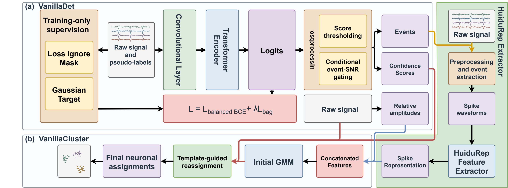

# VanillaSort 🐾

**English** | [简体中文](README.zh-CN.md)

**🛠️ Research code · Paper results · Method development**

VanillaSort is a spike-sorting pipeline for extracellular recordings. It combines **VanillaDet** spike detection, **HuiduRep** waveform representations, and **VanillaCluster** clustering to produce spike times and putative neuronal-unit assignments.

The research implementation provides inference code and pretrained checkpoints for **four-channel recordings sampled at 30 kHz**. For the installable package and SpikeInterface API, see the [package branch](https://github.com/IgarashiAkatuki/VanillaSort/tree/feat/inference-package).

**📄 Paper:** Zishuo Feng and Feng Cao, [*Spike Sorting with VanillaSort*](https://www.biorxiv.org/content/10.64898/2026.09.18.752552), bioRxiv, 2026. **You must cite this paper when using VanillaSort.** [BibTeX](#citation)

<p align="center">
  <a href="assets/vanilla.jpg"></a>
  <br>
  <em>Meet Vanilla, our lovely Maine Coon! 🤍</em>
</p>

[🧠 Architecture](#model-architecture) · [📊 Results](#results) · [📦 Installation](#installation) · [🚀 Quick start](#quick-start) · [🧪 Your data](#sort-your-data) · [📁 Outputs](#outputs) · [⚙️ Configuration](#configuration) · [🔬 Method](#method) · [🛠️ Development](#research-and-development)

## Model architecture

<p align="center">
  <a href="assets/architecture.jpg"></a>
</p>

**VanillaDet → HuiduRep → VanillaCluster.** The diagram shows detector training and event selection, waveform representation learning, and clustering with relative-amplitude features and template-guided reassignment.

## Results

The [paper's Tables 1–2](https://www.biorxiv.org/content/10.64898/2026.09.18.752552) report results on **Hybrid Janelia Static and Drift**, with nine recordings per subset and ground-truth units with SNR ≥ 3. Sorting accuracy is `TP / (TP + FP + FN)`, with event matching within ±6 samples. Values below are **mean ± SEM**; higher is better.

| Spike sorter | Static accuracy | Drift accuracy |
| --- | ---: | ---: |
| HerdingSpikes2 | 0.35 ± 0.01 | 0.29 ± 0.01 |
| IronClust | 0.57 ± 0.04 | 0.54 ± 0.03 |
| JRClust | 0.47 ± 0.04 | 0.35 ± 0.03 |
| KiloSort | 0.60 ± 0.02 | 0.51 ± 0.02 |
| KiloSort2 | 0.39 ± 0.03 | 0.30 ± 0.02 |
| KiloSort4 | 0.40 ± 0.03 | 0.34 ± 0.02 |
| MountainSort4 | 0.59 ± 0.02 | 0.36 ± 0.02 |
| MountainSort5 | 0.40 ± 0.06 | 0.33 ± 0.04 |
| SpykingCircus | 0.57 ± 0.01 | 0.48 ± 0.02 |
| Tridesclous | 0.54 ± 0.03 | 0.37 ± 0.02 |
| SimSort | 0.62 ± 0.04 | 0.56 ± 0.03 |
| HuiduRep (without DAE) | 0.69 ± 0.02 | 0.56 ± 0.02 |
| HuiduRep (with DAE) | 0.70 ± 0.02 | 0.60 ± 0.02 |
| **VanillaSort (without DAE)** | **0.73 ± 0.02** | 0.61 ± 0.02 |
| **VanillaSort (with DAE)** | **0.73 ± 0.01** | **0.64 ± 0.02** |

DAE denotes a denoising autoencoder. Other-tool scores are the SpikeForest or original-publication results used in the paper.

- **Detection:** VanillaDet achieves 0.74/0.71 accuracy on Static/Drift, compared with SimSort's 0.72/0.68 and amplitude thresholding's 0.61/0.60.
- **Sorting:** VanillaSort improves accuracy over the corresponding HuiduRep baselines by **3–4 percentage points on Static** and **4–5 points on Drift** (paired Wilcoxon test, *p* < 0.05).

## Installation

Requirements: **Python 3.10+**, **PyTorch 2.7.0+**, and **CUDA 12.8+** with a compatible NVIDIA driver for GPU execution. **Use the latest compatible stable releases whenever possible.**

Create a virtual environment:

```bash
git clone https://github.com/IgarashiAkatuki/VanillaSort.git
cd VanillaSort
python -m venv .venv
source .venv/bin/activate
python -m pip install --upgrade pip
```

On Windows PowerShell, activate the environment with `.venv\Scripts\Activate.ps1`.

For GPU execution, select **Stable** and the newest compatible CUDA version **12.8 or later** in the [PyTorch installation selector](https://pytorch.org/get-started/locally/). Use its wheel index in the installation command. The table includes a CUDA 12.8 example:

| Platform | Command |
| --- | --- |
| Linux / Windows, CPU | `python -m pip install --upgrade "torch>=2.7.0" --index-url https://download.pytorch.org/whl/cpu` |
| Linux / Windows, NVIDIA GPU, CUDA 12.8 example | `python -m pip install --upgrade "torch>=2.7.0" --index-url https://download.pytorch.org/whl/cu128` |
| macOS, Apple silicon, CPU | `python -m pip install --upgrade "torch>=2.7.0"` |

Install the latest numerical dependencies compatible with your environment:

```bash
python -m pip install --upgrade numpy scipy scikit-learn joblib threadpoolctl psutil
```

[`requirements.txt`](requirements.txt) records the numerical dependency versions from the original environment for reproducibility. Each run records its installed versions in `run.json`.

Both model checkpoints are included in [`checkpoints/`](checkpoints/). Run the examples below from the repository root.

## Quick start

Run the complete pipeline on the built-in two-second synthetic recording with four mixture components:

```bash
python run.py --self-test --device cpu --output output/self-test
```

This checks detection, waveform encoding, clustering, and result export. A successful run prints `Done:` and saves `events.npz` and `run.json` in `output/self-test/`.

For your recordings, `--device auto` selects CUDA when available and CPU otherwise. Use a new or empty output directory for each run.

## Sort your data

### Prepare the input

Save a NumPy `.npz` archive containing:

| Key | Shape | Content |
| --- | --- | --- |
| `traces` | `(T, 4)` | Raw voltage samples, with time along the first axis. `float32` is recommended. |
| `coords` | `(4, 2)` | Physical channel coordinates in micrometres, in the same channel order as `traces`. |
| `fs_hz` | Scalar | Sampling frequency in Hz; use `30000.0`. |

Use finite values, at least 100 time samples, and a common voltage scale across channels. Filtering and normalization are applied by the pipeline. For a larger probe, export a four-channel group and its matching coordinates.

For example, package existing trace and coordinate arrays:

```python
import numpy as np

traces = np.load("traces.npy")  # (T, 4)
coords = np.load("coords.npy")  # (4, 2), micrometres

np.savez(
    "recording.npz",
    traces=traces.astype(np.float32),
    coords=coords.astype(np.float32),
    fs_hz=30000.0,
)
```

### Run sorting

```bash
python run.py --input recording.npz --components 22 --output output/recording-k22
```

Set `--components` to the number of Gaussian mixture components, **K**, chosen for your recording. K must be at least 2, and the number of sortable events must be at least K. The bundled Hybrid Janelia settings use **22** for recordings **11/12** and **24** for **21/22/31/32**.

You can also supply separate `.npy` files:

```bash
python run.py --input traces.npy --coords coords.npy --fs 30000 --components 22 --output output/recording-npy
```

An NPZ `fs_hz` value takes precedence over `--fs`; `--coords` takes precedence over coordinates stored in the NPZ.

To export spike detections alone:

```bash
python run.py --input recording.npz --detect-only --output output/detections
```

## Outputs

Each run writes two files:

| File | Content |
| --- | --- |
| `events.npz` | Event times, detector scores, and, for sorting runs, labels and model outputs. |
| `run.json` | Configuration, sampling rate, event counts, normalization statistics, runtime, package versions, checkpoint SHA-256 hashes, and processing diagnostics. |

The following arrays are saved for a completed clustering run. Here, **D** is the number of accepted detections, **N** is the number of sortable events, and **K** is the requested component count.

| Array | Shape | Meaning |
| --- | --- | --- |
| `detection_samples` | `(D,)` | Accepted detection times as zero-based sample indices. |
| `detection_scores` | `(D,)` | Detector sigmoid scores. |
| `detection_snrs` | `(D, 4)` | Per-event, per-channel SNR estimates. |
| `samples` | `(N,)` | Sample indices of events retained for sorting. |
| `scores` | `(N,)` | Detector scores aligned with `samples`. |
| `labels`, `initial_labels` | `(N,)` each | Final assignments and initial GMM assignments, indexed from `0` to `K - 1`. |
| `features` | `(N, 32)` | HuiduRep embeddings standardized across events in the recording. |
| `auxiliary` | `(N, 3)` | Standardized relative-amplitude contrasts. |
| `templates` | `(2, K, 60, 4)` | Waveform templates indexed by target fold, component, sample, and channel. |
| `core_counts` | `(2, K)` | Core-event counts used to determine template availability. |
| `means` | `(K, 35)` | GMM component means in the combined feature space. |
| `covariances`, `weights` | `(K, 35, 35)`, `(K,)` | GMM full covariance matrices and mixture weights. |

Sorting retains detections satisfying `30 <= sample < T - 30` and extracts waveform offsets `-30` through `+29`. This accounts for the difference between D and N. Detection-only runs save the three `detection_*` arrays.

Read spike times in seconds and select a unit:

```python
import json
from pathlib import Path
import numpy as np

output = Path("output/recording-k22")
metadata = json.loads((output / "run.json").read_text(encoding="utf-8"))
with np.load(output / "events.npz") as events:
    spike_times_s = events["samples"] / metadata["fs_hz"]
    unit_ids = events["labels"]

unit_0_times_s = spike_times_s[unit_ids == 0]
units, spike_counts = np.unique(unit_ids, return_counts=True)
print(dict(zip(units.tolist(), spike_counts.tolist())))
```

Times are relative to the start of the supplied recording. Review putative units using their waveforms, firing rates, and inter-spike intervals. The `clustering` section of `run.json` records GMM convergence, warnings, template construction, and changes made during assignment refinement.

## Configuration

Common command-line options:

| Option | Default | Purpose |
| --- | --- | --- |
| `--components K` | Required for sorting your data | Number of GMM components. |
| `--profile d1` | `d1` | Select `d1` or `canonical` preprocessing. |
| `--seed 30` | `30` | Random seed for the run and its single GMM initialization. |
| `--device auto` | `auto` | Select `auto`, `cpu`, `cuda`, or a device such as `cuda:0`. |
| `--seconds 10` | Entire recording | Process the first 10 seconds; the value must fit within the recording. |
| `--detector-batch 8` | `8` | Number of 2,500-sample chunks per detector batch. |
| `--embedding-batch 128` | `128` | Number of waveforms per HuiduRep batch. |
| `--gpu-fraction 0.4` | `0.4` | Limit the PyTorch CUDA allocator to this fraction of device memory. |
| `--output PATH` | `output` | New or empty result directory. |

CUDA out-of-memory handling halves the affected inference batch and retries. Filtering and normalization use the entire selected recording in host memory. Before processing, the runner checks for approximately `12 × input array bytes + 512 MiB` of available RAM; waveform and feature storage also grows with the event count.

The profiles and model settings are defined in [`config.json`](config.json):

| Setting | `d1` (default) | `canonical` |
| --- | --- | --- |
| Band-pass filter | 300–5,000 Hz, order 5 | 200–6,000 Hz, order 3 |
| Notch filter | 60 Hz | Off |
| Detection threshold | 0.039 | 0.038 |
| Direct-acceptance threshold | 0.045 | 0.041 |
| Waveform source | Filtered voltage | Filtered voltage with per-channel median/MAD normalization |

Both profiles use per-channel median/MAD normalization for detector input. Event-SNR gating uses the canonical 200–6,000 Hz signal. Processing a prefix with `--seconds` also fits normalization and clustering to that prefix. Keep `run.json` with your results to record these choices.

## Method

1. **VanillaDet — detect spikes.** A convolutional frontend and a six-layer local Transformer produce sample-level scores. The bundled model uses 256-dimensional hidden states, four attention heads, rotary positional encoding, and L2-normalized queries and keys. Peak selection applies a 12-sample exclusion radius. Events at or above the direct-acceptance threshold are retained; events between the two thresholds require a primary-channel SNR of at least 3 and an SNR of at least 2 on another channel.
2. **HuiduRep — encode waveforms.** Each event contributes a 60-sample, four-channel waveform. Preprocessing standardizes each channel over events and time, interpolates to 90 samples, and repeats/crops channels to 11 inputs. HuiduRep applies internal denoising and produces a 32-dimensional representation, which is standardized across the recording's events.
3. **VanillaCluster — assign units.** Three relative-amplitude features are formed from per-channel peak-to-peak amplitude fractions, projected onto a Helmert contrast basis, and standardized. A full-covariance GMM clusters the resulting 35-dimensional vectors. One template-residual refinement pass then updates assignments among the top three candidate components.

Template refinement splits events into alternating one-second blocks. For each target fold, templates are built from the opposite fold using events with GMM posterior probability of at least 0.9. Each core pool is capped at 512 events, then its lowest-scoring 25% by detector score is removed. A valid template requires at least 30 retained events and nonzero energy. Residual fitting searches shifts of ±2 samples and shared amplitude scales from 0.5 to 2.0; event timestamps are preserved. Events with insufficient template support retain their GMM assignments.

## Research and development

- Extend the detector in [`detector_model.py`](detector_model.py) or the waveform representation models in [`huidurep/`](huidurep/), using checkpoints that match the model architecture.
- Configure inference experiments in [`config.json`](config.json); preprocessing, event selection, and clustering are implemented in [`run.py`](run.py) and [`frozen_ops.py`](frozen_ops.py).
- After changes, run the [synthetic quick start](#quick-start). Keep each experiment's `run.json` alongside its outputs to record parameters, random seeds, dependency versions, and checkpoint hashes.

## Repository layout

| Path | Role |
| --- | --- |
| [`run.py`](run.py) | CLI, input loading, preprocessing, inference, clustering, and export. |
| [`detector_model.py`](detector_model.py) | VanillaDet convolutional frontends, attention layers, and prediction head. |
| [`huidurep/`](huidurep/) | HuiduRep encoder, decoders, projection modules, and the `CMAES` model class. |
| [`frozen_ops.py`](frozen_ops.py) | Numerical operations for event selection, waveform preparation, amplitude features, and template refinement. |
| [`config.json`](config.json) | Model architectures, profiles, thresholds, and clustering settings. |
| [`checkpoints/`](checkpoints/) | `detector_mask_r4_best_ap.pt` and `HuiduRep.pt`. |
| [`requirements.txt`](requirements.txt) | Reference versions of the numerical dependencies for reproducing the original environment. |

## Citation

**Use of VanillaSort requires citation of the following paper:**

Zishuo Feng and Feng Cao. **Spike Sorting with VanillaSort.** bioRxiv, 2026. [doi:10.64898/2026.09.18.752552](https://www.biorxiv.org/content/10.64898/2026.09.18.752552).

```bibtex
@article{feng2026vanillasort,
  title   = {Spike Sorting with {VanillaSort}},
  author  = {Feng, Zishuo and Cao, Feng},
  journal = {bioRxiv},
  year    = {2026},
  doi     = {10.64898/2026.09.18.752552},
  url     = {https://www.biorxiv.org/content/10.64898/2026.09.18.752552}
}
```

## License

[GNU Affero General Public License v3.0](LICENSE).
